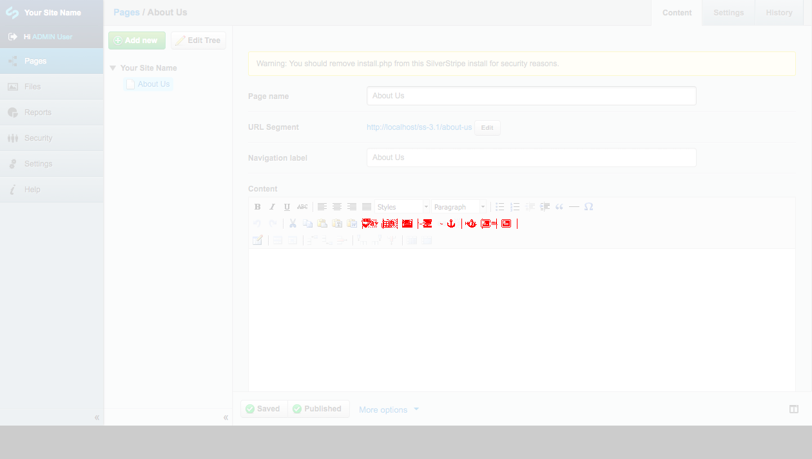

# Behat Perceptual Diffs for SilverStripe CMS

Enables visual diff regression testing for SilverStripe CMS,
through the existing Behat test coverage.

Builds on the awesome [BehatPerceptualDiff](https://github.com/jadu/BehatPerceptualDiffExtension) extension, 
which is based on concepts from [Huxley](https://github.com/facebook/huxley).
Customizes the extension's `StepTester` class to wait
for jQuery ajax requests to complete before taking the screenshot,
which makes the logic a lot more useful to the SilverStripe CMS UI,
and avoids error-prone static sleep periods.

This extension is only required for perceptual diff testing
in the SilverStripe CMS UI. For perceptual diffs on websites
running SilverStripe, use the underlying [BehatPerceptualDiff](https://github.com/jadu/BehatPerceptualDiffExtension) extension directly.



Preview of a visual diff from the SilverStripe CMS UI (added buttons in TinyMCE editor)

## Installation

Follow the [SilverStripe Behat Extension](https://github.com/silverstripe-labs/silverstripe-behat-extension/) install instructions
to get a basic project set up with Behat.

Add the perceptual diff extension

```
composer require silverstripe/behat-perceptual-diff
```

Replace the `behat.yml` in your project root with the following content.
Adjust the `base_url` accordingly.

```yml
default:
  filters:
    tags: "~@todo"
  formatter:
    name: pretty

  extensions:

    SilverStripe\BehatExtension\MinkExtension:
      base_url:  http://localhost/
      files_path: %behat.paths.base%/framework/tests/behat/features/files/
      default_session: selenium2
      javascript_session: selenium2
      goutte: ~
      selenium2:
        browser: firefox

    SilverStripe\BehatExtension\Extension: ~

    Zodyac\Behat\PerceptualDiffExtension\Extension:
      sleep: 0.3
      path: pdiffs
      fail_on_diff: true
      compare:
        highlight_color: red
        metric: AE
        fuzz: 20

    SilverStripe\Behat\PerceptualDiffExtension\Extension: ~
```

It is important that `Zodyac\Behat\PerceptualDiffExtension\Extension:sleep`
is set reasonably high (around 0.3s), in order to give
the CMS UI time to process ajax responses and render the UI.

## Usage

Run your behat tests as usual, each step will generate a screenshot
in the `pdiff/` folder. The first run will create a `pdiff/baseline/`
folder, additional runs will compare against that.